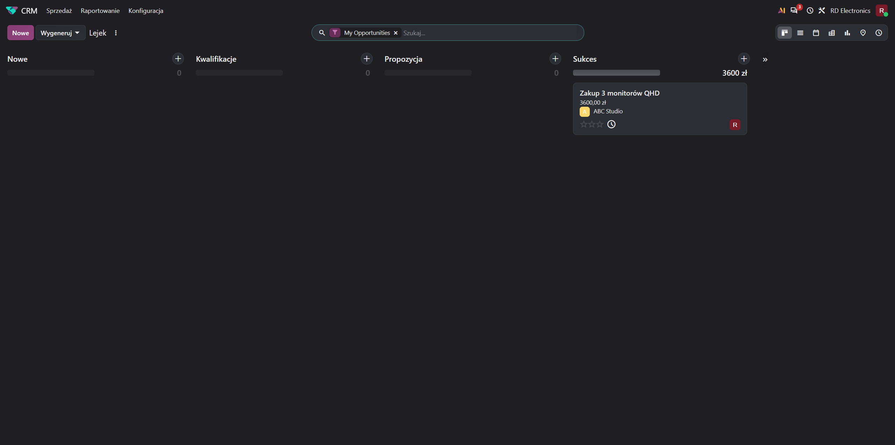
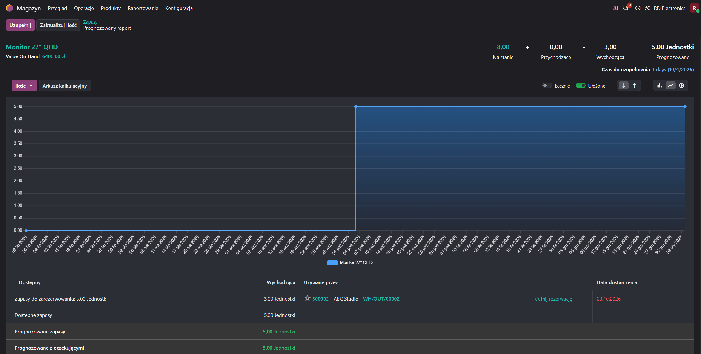
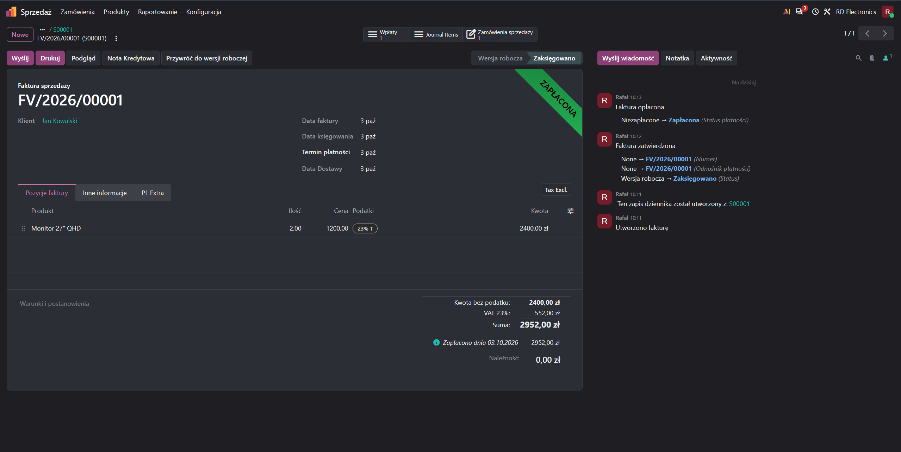
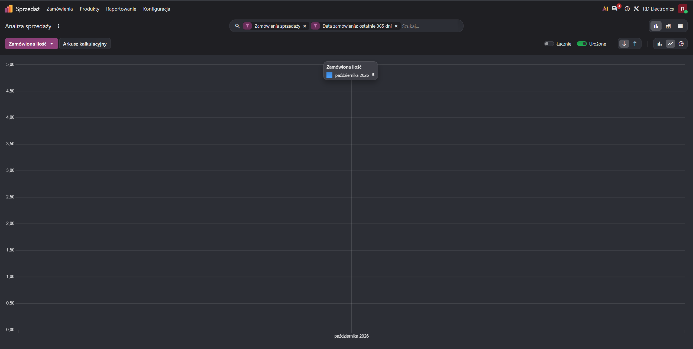

# Odoo ERP Business Process Simulation

Practical simulation of core ERP business processes in Odoo, covering CRM, Sales, Purchase, Inventory and Invoicing.

## Project scope

The project demonstrates end-to-end business processes in a test company environment using Odoo ERP.

### P2P - Procure-to-Pay
Process from purchasing goods to paying the supplier:

1. Created a product and supplier
2. Created an RFQ - Request for Quotation
3. Confirmed a Purchase Order
4. Received goods into inventory
5. Created and posted a Vendor Bill
6. Registered supplier payment

### O2C - Order-to-Cash
Process from customer order to receiving payment:

1. Created a sales quotation
2. Confirmed a Sales Order
3. Reserved and delivered goods
4. Created and posted a Customer Invoice
5. Registered customer payment

### CRM Sales Pipeline

Created a sales opportunity and moved it through:

New -> Qualification -> Proposition -> Won

The opportunity was then converted into a sales quotation and Sales Order.

### Inventory Management

The project included:

- stock tracking
- incoming and outgoing stock movements
- stock reservations
- On Hand vs Forecasted inventory
- inventory valuation
- demand-based stock forecasting

### Reporting

Used Odoo reporting tools to analyze:

- ordered quantities
- inventory availability
- outgoing reservations
- forecasted stock levels
- sales activity

## Odoo modules used

- CRM
- Sales
- Purchase
- Inventory
- Invoicing

## Screenshots

### CRM Opportunity Won

### Inventory Forecast

### Customer Invoice Paid

### Sales Analysis

## Key concepts practiced

- P2P - Procure-to-Pay
- O2C - Order-to-Cash
- CRM sales pipeline
- Purchase Orders
- Sales Orders
- inventory reservations
- stock forecasting
- invoicing and payments
- ERP process integration
